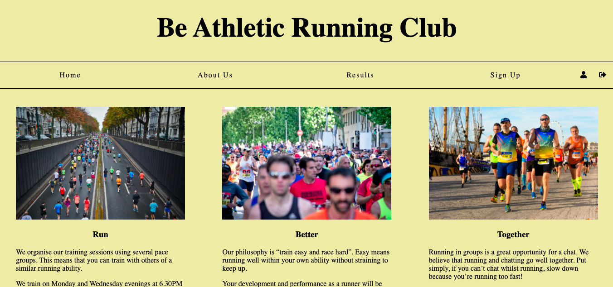

# Be Athletic Running Club Project

## Goal
This project forms part of the Codecademy Full-stack web developer course. The goal of this project was to create a responsive club website of our choosing. 

## Languages & Tools Used
1. HTML
2. CSS
3. Git & Github
4. Command line 
